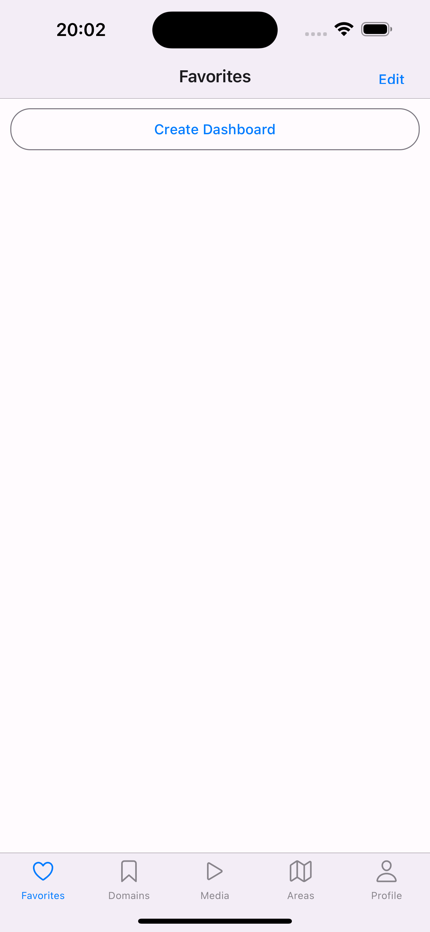
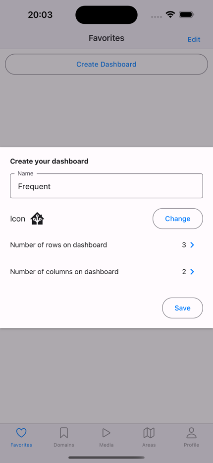
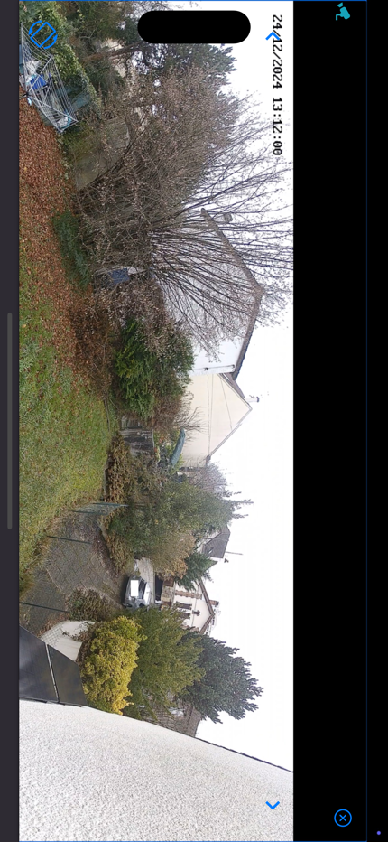
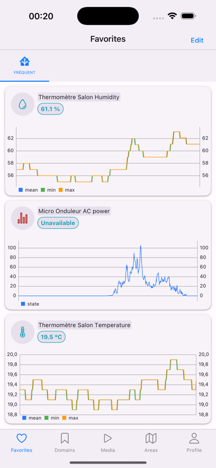
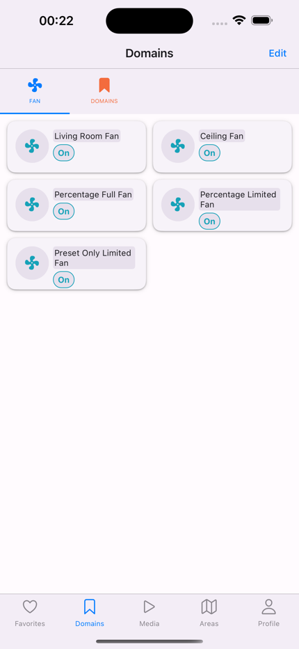
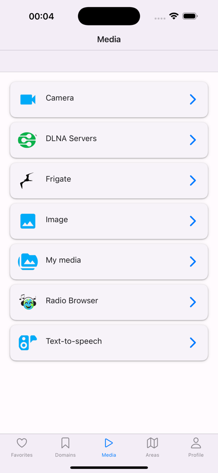
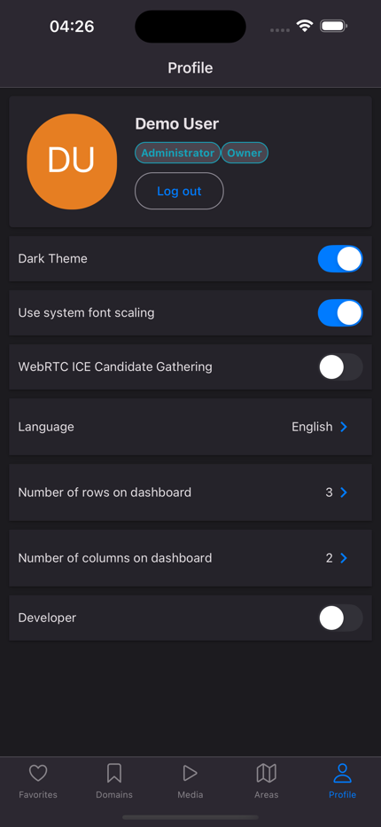

# User Guide

## Introduction

Hachier is a mobile app designed to provide a native look and feel for interacting with Home Assistant. It is not a replacement for the Home Assistant client but acts as a remote for quick access to frequently used objects and functionalities.

The application is free and experimental. Use it at your own risk. We cannot be held responsible for any consequences resulting from bugs or issues within the app. Hachier is not endorsed or supported by Home Assistant. Personally, I use Hachier as a remote for quick actions (especially when Siri fails to understand my commands), such as checking cameras, controlling the TV, arming/disarming the alarm, or opening/closing secured doors that voice commands cannot handle.

Key Features

- **WebRTC Communication**
  with Frigate cameras, enabling PTZ (Pan-Tilt-Zoom) control and bidirectional audio without requiring HTTPS configuration or trusted certificates. You can also browse recordings and events quickly via the Media section.
- **Health Check Notifications**
  ensures you receive notifications if your Home Assistant server goes offline. This feature is especially useful if you rely on Home Assistant's built-in alarm system. For example, if someone cuts power to your server and you don't have a backup power supply, you will be notified promptly.
- **Dashboard for Quick Access**
  The app includes a customizable dashboard where you can add Home Assistant objects to monitor their states or control them directly. This feature lets you quickly consult or interact with entities like lights, sensors, or cameras from one central place.
- **Customizable Entity Cards**
  Each entity can be associated with a photo for quick differentiation. Card sizes are configurable, and buttons are large to enhance accessibility.
- **Statistics**
  Entities with statistical data can be added to a dashboard for quick consultation, providing a concise overview of critical metrics.
- **Intuitive Navigation**
  Navigation is organized by domains (similar to Home Assistant domains such as cameras, sensors, etc.) and by areas for better accessibility and organization.

## Authentication

To start using Hachier, enter your Home Assistant URL. The simplest and most secure way to do this is by setting up a VPN solution (such as WireGuard) to access your network when you're outside your home.

- **HTTP Support**
  Home Assistant over HTTP is supported, including bidirectional audio calls to your cameras.
- **Health Check**
  Continuously monitors your Home Assistant server in the background and notifies you if it goes offline.

## Favorites

Favorites group dashboards that are frequently accessed. Each time the application returns from the background, the first dashboard under Favorites will be displayed.

[Go to Domains section to see how to add entities to Favorites dashboard](#domains)

[Go to Areas section to see how to add entities to Favorites dashboard](#areas)

Once entities are added to the dashboard, you'll be able to view and control them directly from the dashboard.

Press on Edit to reorganize or delete entities from the dashboard.

Press on the pencil icon to modify the card size for each entity by adjusting the number of rows and columns in the dashboard's grid system. However, if the card size becomes too small, the timeline, statistic charts, or photos will not be displayed properly.

You can also associate an image with your card, which will be displayed instead of the default state timeline chart (or camera's thumbnail). To do so, press on the photo icon.

You can press the icon button next to the entity name and state for quick actions. Most of the time, these actions include turning on, turning off, opening, closing, arming, or disarming the alarm. For complete control and information about the entity (for camera entities, the camera stream will be displayed), press on the card.

## Areas

Displays all Home Assistant areas, the devices within each area, and the entities associated with each device.

Press the heart (favorites) icon to start adding entities to your **Favorites** dashboard.

Once finished, press Done to save the entities to your **Favorites** dashboard.

## Domains

Display all Home Assistant domains, the device classes within each domain, and the entities associated with each device class.

Press the heart (favorites) icon to begin adding entities to your **Favorites** dashboard.

You can also press the pin button to create a new dashboard containing all entities from a specific domain or device class under the **Domains** section.

## Media

Not much to talk about this section, it's the same hierarchy as Home Assistant, you can check your Frigate camera's events here.

## Profile

This section allows you to:

- Log out of your current Home Assistant account.
- Change your language or theme modes.
- Some **advanced** configuration options, such as use system font scaling and developer mode (for more information on the entity).
- Set the default number of rows and columns for the grid system across all your dashboards.

## Acknowledgments

This project includes partial code from [Home Assistant](https://github.com/home-assistant/core), which is licensed under the Apache 2.0 License.
